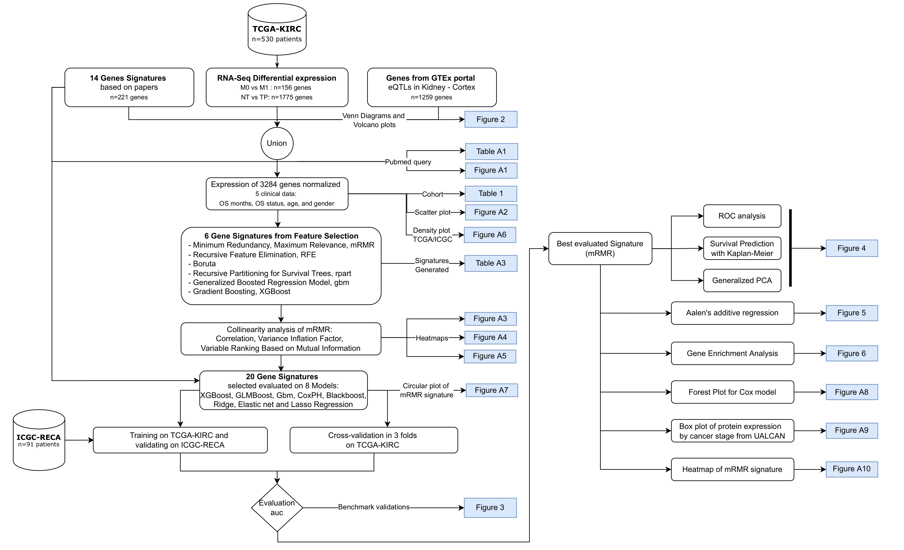

# A Novel Machine Learning 13-Gene Signature: Improving Risk Analysis and Survival Prediction for Clear Cell Renal Cell Carcinoma Patients

Patrick Terrematte<sup>1,2</sup>, Dhiego Souto Andrade<sup>1</sup> , Josivan Justino<sup>1,3</sup>, Beatriz Stransky<sup>1,4</sup>, Daniel Sabino A. de Araújo<sup>1</sup> and Adrião D. Dória Neto <sup>1</sup>

<sup>1</sup>	Bioinformatics Multidisciplinary Environment (BioME), Metropole Digital Institute (IMD), Federal University of Rio Grande do Norte (UFRN), Natal, Brazil;

<sup>2</sup>	Department of Engineering and Technology (DETEC), Pau dos Ferros Multidisciplinary Center, Federal Rural University of Semi-arid (UFERSA), Pau dos Ferros,  Brazil;

<sup>3</sup>	Department of Mathematics and Statistics (DME), Federal University of Rondônia (UNIR), Ji-Paraná, Brazil;

<sup>4</sup>	Biomedical Engineering Department, Center of Technology, UFRN, Natal, Brazil;

<sup>5</sup>	Department of Computer Engineering and Automation, UFRN, Natal, Brazil;


**Simple Summary:** Clear cell Renal cell carcinoma is a type of kidney cancer which comprises the majority of all renal cell carcinomas. Many efforts have been made to identify biomarkers which could help healthcare professionals better treat this kind of cancer. With extensive public data available, we conducted a machine learning study to determine a gene signature that could indicate patient survival with high accuracy. Through the min-Redundancy and Max-Relevance algorithm we generated a signature of 13 genes highly correlated to patient outcomes. These findings reveal potential strategies for personalized medicine in the clinical practice. 

**Abstract:** Patients with clear cell Renal cell carcinoma (ccRCC) have poor survival outcomes, especially if it has metastasized. It is of paramount importance to identify biomarkers in genomic data that could help predict the aggressiveness of ccRCC and its resistance to drugs. Thus, we conducted a study with the aims of evaluating gene signatures and proposing a novel one with higher predictive power and generalization in comparison to the former signatures. Using ccRCC cohorts of the Cancer Genome Atlas (TCGA-KIRC) and International Cancer Genome Consortium (ICGC-RECA), we evaluated linear survival models of Cox regression with 14 signatures and 6 methods of feature selection, and performed functional analysis and differential gene expression approaches. In this study, we established a 13-gene signature (AR, AL353637.1, DPP6, FOXJ1, GNB3, HHLA2, IL4, LIMCH1, LINC01732, OTX1, SAA1, SEMA3G, ZIC2) whose expression levels are able to predict distinct outcomes of patients with ccRCC. Moreover, we performed a comparison between our signature and others from the literature. The best-performing gene signature was achieved using the ensemble method of min-Redundancy and Max-Relevance (mRMR). This signature comprises unique features in comparison to the others, such as generalization through different cohorts and being functionally enriched in significant pathways: Urothelial Carcinoma, Chronic Kidney disease, and Transitional cell carcinoma, Nephrolithiasis. From the 13 genes in our signature, 8 are known to be correlated with ccRCC patient survival and 4 are immune-related. Our model showed a performance of 0.82 using the Receiver Operator Characteristic (ROC) Area Under Curve (AUC) metric and it generalized well between the cohorts. Our findings revealed two clusters of genes with high expression (SAA1, OTX1, ZIC2, LINC01732, GNB3 and IL4) and low expression (AL353637.1, AR, HHLA2, LIMCH1, SEMA3G, DPP6, and FOXJ1) which are both correlated with poor prognosis. This signature can potentially be used in clinical practice to support patient treatment care and follow-up.

**Keywords:** Kidney cancer; clear cell Renal Cell Carcinoma (ccRCC); Gene signature; Prognosis; Survival analysis; Feature selection; Mutual Information; Machine Learning

[](Flowchart)

### Please cite us for any use of the figure scripts, methodology or results
    
Terrematte, P.; Andrade, D.S.; Justino, J.; Stransky, B.; de Araújo, D.S.A.; Dória Neto, A.D. A Novel Machine Learning 13-Gene Signature: Improving Risk Analysis and Survival Prediction for Clear Cell Renal Cell Carcinoma Patients. Cancers 2022, 14, 2111. https://doi.org/10.3390/cancers14092111 

```

@Article{cancers14092111,
AUTHOR = {Terrematte, Patrick and Andrade, Dhiego Souto and Justino, Josivan and Stransky, Beatriz and de Araújo, Daniel Sabino A. and Dória Neto, Adrião D.},
TITLE = {A Novel Machine Learning 13-Gene Signature: Improving Risk Analysis and Survival Prediction for Clear Cell Renal Cell Carcinoma Patients},
JOURNAL = {Cancers},
VOLUME = {14},
YEAR = {2022},
NUMBER = {9},
ARTICLE-NUMBER = {2111},
URL = {https://www.mdpi.com/2072-6694/14/9/2111},
ISSN = {2072-6694},
ABSTRACT = {Patients with clear cell renal cell carcinoma (ccRCC) have poor survival outcomes, especially if it has metastasized. It is of paramount importance to identify biomarkers in genomic data that could help predict the aggressiveness of ccRCC and its resistance to drugs. Thus, we conducted a study with the aims of evaluating gene signatures and proposing a novel one with higher predictive power and generalization in comparison to the former signatures. Using ccRCC cohorts of the Cancer Genome Atlas (TCGA-KIRC) and International Cancer Genome Consortium (ICGC-RECA), we evaluated linear survival models of Cox regression with 14 signatures and six methods of feature selection, and performed functional analysis and differential gene expression approaches. In this study, we established a 13-gene signature (AR, AL353637.1, DPP6, FOXJ1, GNB3, HHLA2, IL4, LIMCH1, LINC01732, OTX1, SAA1, SEMA3G, ZIC2) whose expression levels are able to predict distinct outcomes of patients with ccRCC. Moreover, we performed a comparison between our signature and others from the literature. The best-performing gene signature was achieved using the ensemble method Min-Redundancy and Max-Relevance (mRMR). This signature comprises unique features in comparison to the others, such as generalization through different cohorts and being functionally enriched in significant pathways: Urothelial Carcinoma, Chronic Kidney disease, and Transitional cell carcinoma, Nephrolithiasis. From the 13 genes in our signature, eight are known to be correlated with ccRCC patient survival and four are immune-related. Our model showed a performance of 0.82 using the Receiver Operator Characteristic (ROC) Area Under Curve (AUC) metric and it generalized well between the cohorts. Our findings revealed two clusters of genes with high expression (SAA1, OTX1, ZIC2, LINC01732, GNB3 and IL4) and low expression (AL353637.1, AR, HHLA2, LIMCH1, SEMA3G, DPP6, and FOXJ1) which are both correlated with poor prognosis. This signature can potentially be used in clinical practice to support patient treatment care and follow-up.},
DOI = {10.3390/cancers14092111}
}
```


